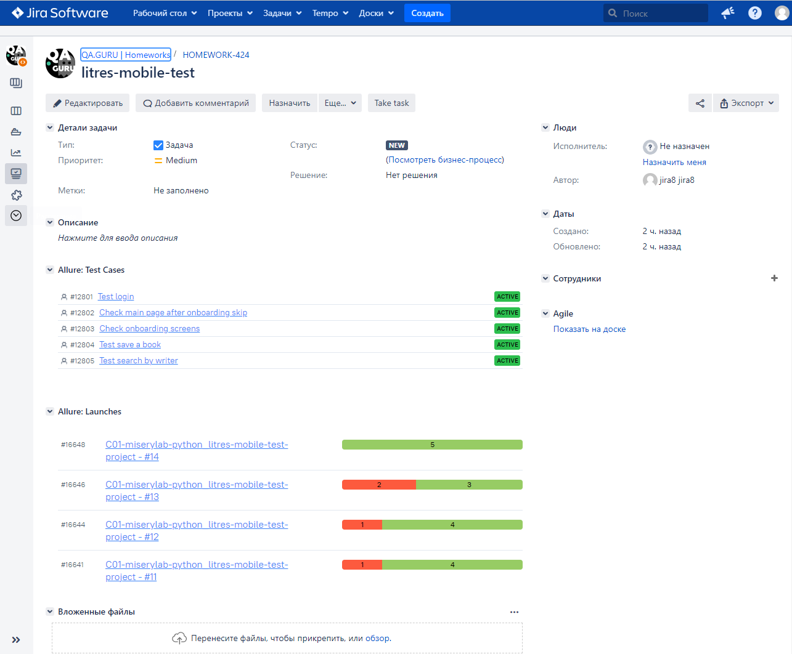

# Test automation project for [Litres](https://www.litres.ru/o-kompanii/) mobile app


> LitRes is an international company that produces and distributes e-books and digital audiobooks.

# <a name="TableOfContents">Table of contents</a>
+ [Description](#Description)
+ [Tools and technologies](#Technology)
+ [How to run](#HowToRun)
    + [Config files](#ConfigFiles)
    + [Run in Jenkins](#RunInJenkins)
+ [Telegram Notifications](#TelegramNotifications)
+ [Test results report in Allure Report](#AllureReport)
+ [Allure TestOps integration](#AllureTestOps)
+ [Jira integration](#Jira)
+ [Video of running tests](#Video)


# <a name="Description">Description</a>
The test project consists of mobile(android) tests.

[Back to the table of contents ⬆](#TableOfContents)

# <a name="Technology">Tools and a technologies</a>
<p  align="center">
  
  
  
  
  
  
  
  
  
  
  
</p>

The autotests in this project are written in `Python` using `Selene` framework.\
`Jenkins` - CI/CD for running tests remotely.\
`Browserstack` - to run mobile tests.\
`Android Studio tools`, `Appium` - to tun mobile tests locally in a mobile device emulator.\
`Allure Report` - for test results visualisation.\
`Telegram Bot` - for test results notifications.\
`Allure TestOps` - as Test Management System.

[Back to the table of contents ⬆](#TableOfContents)

# <a name="HowToRun">How to run</a>

To run locally with config.personal.env (create it first) the following command is used:
```bash
env -S 'context=emulation' pytest tests/android/test_login.py --alluredir reports/
```
To run in Browserstack and in Jenkins with config.browserstack.env the following command is used:
```bash
env -S 'context=browserstack' pytest tests/android/test_login.py --alluredir reports/
```

[Back to the table of contents ⬆](#TableOfContents)

## <a name="ConfigFiles">Config files</a>
Possible properties in a config file:
```properties
platformName=
platformVersion=
deviceName=
app=
remote_url=
user_name=
access_key=
projectName=
buildName=
sessionName=
appWaitActivity=
systemPort=
```


### <a name="CongigFileExample">Config file examples</a>


* <details>
    <summary><h4>config.browserstack.env.example</h4></summary>

    ```properties
        platformName='android'
        platformVersion='11.0'
        deviceName='Google Pixel 4'
        app='bs://xxxxxxxxxxxxxxa55b8e022f13c5827c'
        remote_url='http://hub.browserstack.com/wd/hub'
        user_name='xxxa_QrzYPv'
        access_key='xxxxuBSKtK1F'
        projectName='First Python project'
        buildName='browserstack-build-1'
        sessionName='BStack first_test'
    ```
  
  </details>
* <details>
    <summary><h4>config.emulation.env.examples</h4></summary>

    ```properties
        app='./xxxx_3.66.0(0)-gp.apk'
        appWaitActivity='*.xxxxx.*'
        systemPort=8082
        autoGrantPermissions=false
    ```

  </details>


[Back to the table of contents ⬆](#TableOfContents)

## <a name="RunInJenkins">Run in [Jenkins](https://jenkins.autotests.cloud/job/C01-miserylab-python_litres-mobile-test-project/)</a>
Main page of the build:
<p  align="center">
  
</p>


After the build is done the test results are available in:
>- <code><strong>*Allure Report*</strong></code>
>- <code><strong>*Allure TestOps*</strong></code>

<p  align="center">
  
</p>

[Back to the table of contents ⬆](#TableOfContents)


# <a name="TelegramNotifications">Telegram Notifications</a>
Telegram bot sends a brief report to a specified telegram chat by results of each build.
<p  align="center">

</p>

[Back to the table of contents ⬆](#TableOfContents)

# <a name="AllureReport">Test results report in [Allure Report](https://jenkins.autotests.cloud/job/C01-miserylab-python_litres-mobile-test-project/12/allure/)</a>


<p align="center">
  
</p>

<p align="center">
  
</p>


[Back to the table of contents ⬆](#TableOfContents)

# <a name="AllureTestOps">[Allure TestOps](https://allure.autotests.cloud/project/1659/dashboards) integration</a>
> The link can be accessed only by authorized users.

## <a name="AllureTestOpsProject">Project in Allure TestOps</a>

<p align="center">
  
</p>

<p align="center">
  
</p>

<p align="center">
  
</p>


[Back to the table of contents ⬆](#TableOfContents)

# <a name="Jira">[Jira](https://jira.autotests.cloud/browse/HOMEWORK-424) integration</a>
> The link can be accessed only by authorized users.
<p align="center">
  
</p>

[Back to the table of contents ⬆](#TableOfContents)


# <a name="Video">Video of running tests</a>

https://user-images.githubusercontent.com/95403808/201222870-cecfa7fa-3c09-4526-9298-4850feb7d600.mp4


[Back to the table of contents ⬆](#TableOfContents)


